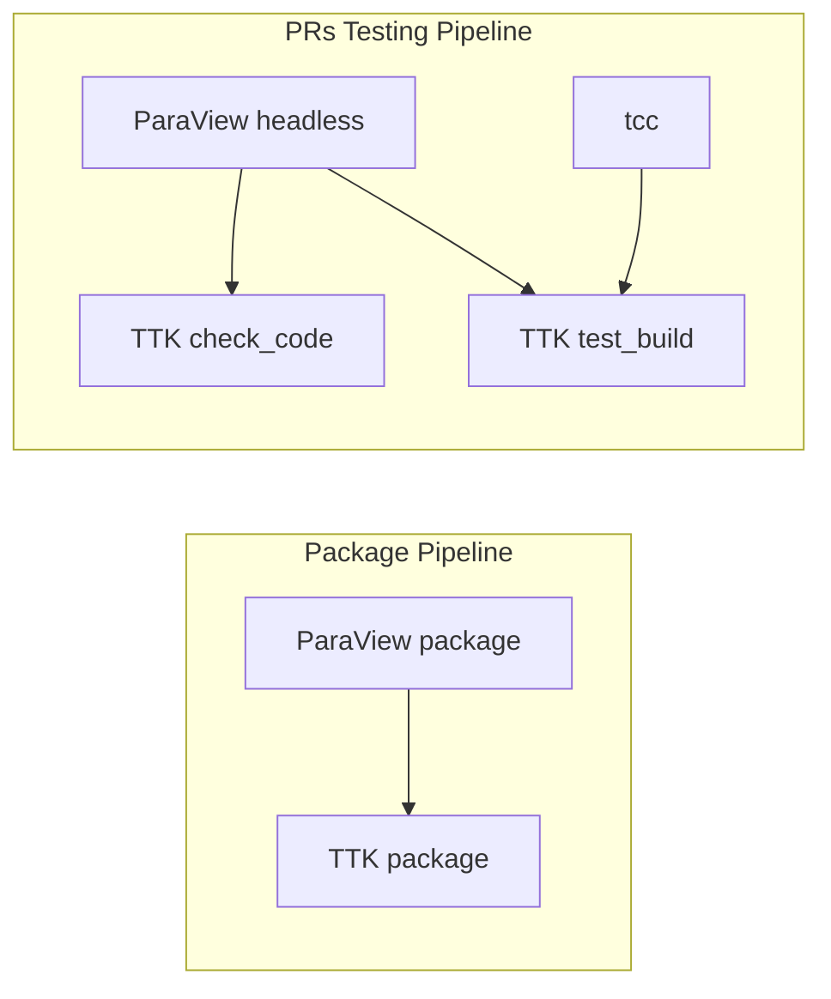
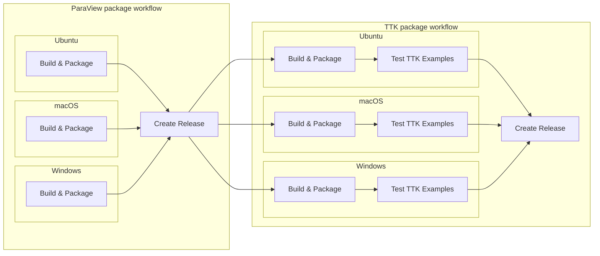
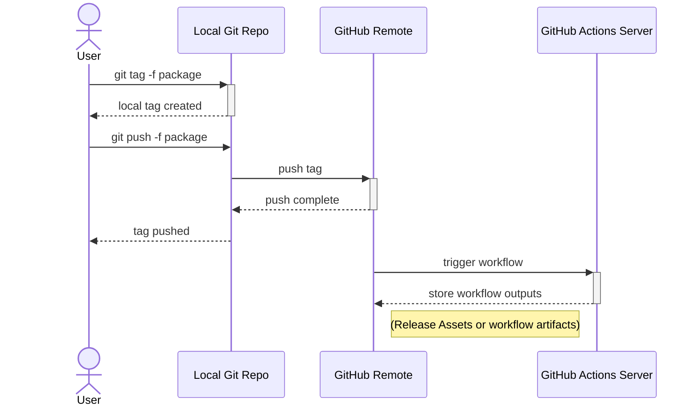
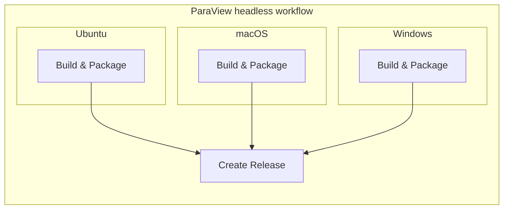
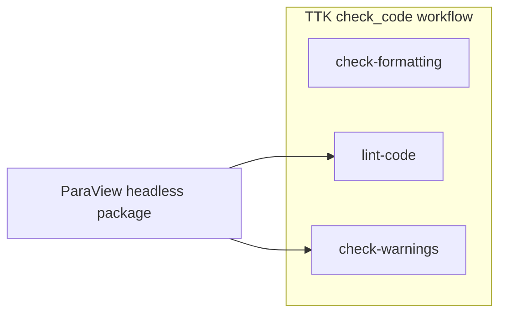
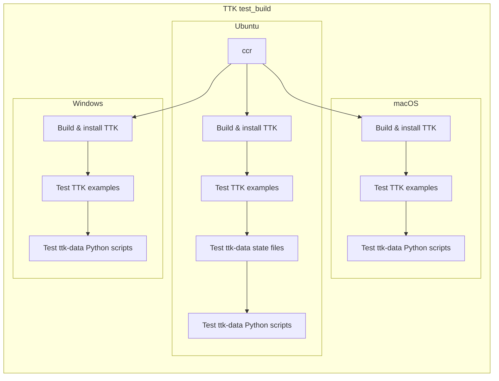

TTK's GitHub Actions CI
=======================

A (brief?) description.

TL;DR
-----

To launch either the *check_code* workflow or the *test_build*
workflow:

```sh
git tag -f [check_code|test_build] && git push -f github_remote [check_code|test_build]
```

To create packages, delete any GitHub Release named "package", then:

```sh
git tag -f package && git push -f github_remote package
```

To create docker packages:

```sh
git tag -f docker && git push -f [remote] docker
```

Workflows
---------

GitHub Actions allows to define complex pipelines, called *workflows*
and triggered by a variety of events. In TTK, these are used to
perform Continuous Integration (CI), meaning testing that occurs at
every Pull Request.

The TTK CI is split into the following files, written in the
[YAML](https://yaml.org/) format:
* The TTK *package* workflow ([package.yml](./package.yml))
* The TTK *check_code* workflow ([check.yml](./check.yml))
* The TTK *test_build* workflow ([test.yml](./test.yml))

Additionally, two other workflows are used to generate ParaView binaries:
* The ParaView *package* workflow ([package.yml](../../paraview/patch/package.yml))
* The ParaView *headless* workflow ([headless.yml](../../paraview/patch/headless.yml))

ParaView's [main.yml](../../paraview/patch/main.yml) *workflow* is an
earlier version of ParaView's
[package.yml](../../paraview/patch/package.yml) left there for
compatibility.

Each of these YAML files correspond to a GitHub Actions
*workflow*. These *workflows* are split into *jobs*, which are run on
a specific [platform/virtual
environment](https://github.com/actions/virtual-environments) (Ubuntu,
macOS or Windows). A *job* is composed of *steps*, which are executed
sequentially.

These YAML files create two separate pipelines: the first generates
release packages for Ubuntu & Windows and comprises the ParaView
*package* and the TTK *package* workflows. The second, triggered by
pull requests, performs extensive tests on TTK's code. It uses all
remaining workflows:
* ParaView's *headless* workflow generates headless packages (without
  the Qt graphical interface) with Offscreen Rendering enabled,
* TTK's *check_code* workflow performs some static analyzes on the
  code and
* TTK's *test_build* workflow builds TTK on all 3 platforms and tests
  it on [ttk-data](https://github.com/topology-tool-kit/ttk-data).



The next sections will describe in more details these pipelines.

Creating Packages
-----------------

GitHub Actions' use was first dedicated to creating binary packages
for TTK. Currently, it is able to generate Debian packages for Ubuntu
20.04 (18.04's Qt is not supported by ParaView anymore) and MSI
installers for Windows (macOS is still WiP right now).

To decouple the ParaView and TTK builds, since ParaView takes 3h to
build, this pipeline has been split in two workflows: the first
workflow build TTK-ParaView packages (from the [TTK vendored version
of ParaView](https://github.com/topology-tool-kit/ttk-paraview)) and
store them as GitHub Release Assets.

Then, the corresponding TTK workflow will use these TTK-ParaView
packages to build TTK. This workflow is split into 3 stages: the build
jobs that build and package TTK, the test jobs that use these packages
to run the TTK examples and finally the *create-release* job that
creates a new GitHub release and store the generated packages as
Release Assets. The ParaView *package* workflow is designed in a
similar way, the main difference is the absence of the testing stage.




These workflows are not meant to be executed at every Pull
Request. They are instead triggered by pushing Git tags to a GitHub
remote repository. Since private repository have a 2k minutes per
month time limit for GitHub Actions, it is recommended to use a public
GitHub repository.

For both the ParaView and the TTK *package* workflows, Git tags should
match a regular expression, which is either `v?\d+.\d+.\d+` or
`pack*`. Additionally, TTK's *package* workflows is also triggered
with the `v*`, `*-*-*` or `*.*.*` regexes.

To push a tag, first create one locally with `git tag [-f] {tag_name}`. The
`-f` flag can be useful if a tag with the same name has already been
created (the tag is then moved to the current HEAD commit). Once the
tag is created locally, push the tag to the remote GitHub repository
with `git push [-f] {remote_name} {tag_name}`. Here again, `-f` helps
moving an already pushed tag. The workflow should then start (go to
the Action tab of the GitHub repository to see it run).



Since both workflows end by creating a GitHub Release whose name is
given by the Git tag, a previous Release with the same name should be
deleted before this step to avoid any error. Go to GitHub, Releases,
select the right one and delete it.

Pull Request Checks
-------------------

This pipeline is intended to be executed at every TTK Pull
Request. However, similarly to the packaging pipeline, its workflows
can also be triggered by Git tags matching regular expressions:

* `v?\d+.\d+.\d+-headless` for generating ParaView headless packages,
* `check*` for the TTK *check_code* workflow,
* `test*` for the TTK *test_build* workflow.

The last two might be of interest for TTK developers that want to
test their code before writing a Pull Request.

### ParaView Headless Packages

To test [ttk-data state
files](https://github.com/topology-tool-kit/ttk-data/tree/dev/tests),
we need a ParaView built with Offscreen Rendering. This workflow
generates headless packages (meaning without the Qt graphical user
interface). This is pretty similar to what is done in the ParaView
*package* workflow.

On Ubuntu and macOS, ParaView is built with Offscreen Rendering
enabled. Sadly, macOS OpenGL renderer is not able to reproduce the
rendering of the state files views (and takes 3 times longer than
Ubuntu to render) and Windows does not offer an Offscreen Rendering
API. However, the macOS and Windows ParaView headless packages are
still used by the TTK workflows.



### The *check_code* workflow

This workflow performs code analyzes on the TTK code and enforces good
C++ practices. It is split into 3 jobs:

* *check-formatting* tries to ensure a well-formatted C++ code using (among others)
  the `clang-format` tool.
* *lint-code* uses `clang-tidy` and `doxygen` to detect defects in the
  code and in its documentation.
* *check-warnings* tries to prevent compiler errors and warnings on a
  variety of configurations using `clang-check`.



The workflow is run on Ubuntu only. The Ubuntu ParaView headless
package is needed for two jobs.

#### The *check-formatting* job

In this job, several code quality analyses are performed. Most notable
is the use of `clang-format` to format the C++ code. Since
`clang-format`'s output has been known to vary depending on the tool's
major version number (this seems to be resolved from v11 and upwards),
this job requires a fixed version of the tool, `clang-format` v11.

Other checks performed in this job include line endings (prefer Unix
`\n` to DOS `\r\n`), empty files, VTK includes in the base layer (that
break the main purpose of the base layer) and `using namespace`
directives in headers (a bad practice in C++).

#### The *lint-code* job

This job needs a configured `CMake` build directory with a maximum of
TTK build options enabled. It uses the Ubuntu ParaView headless
package to provide ParaView and VTK headers. Once configured, 3
analyses are performed in parallel:
* `clang-tidy` checks for C++ patterns that might indicate code
  defects. The list of enabled rules is written in the
  [.clang-tidy](../../.clang-tidy) file. For a complete list and a
  description of each rule, go to the [clang-tidy checks
  page](https://clang.llvm.org/extra/clang-tidy/checks/list.html).
* `clang-tidy` is also used to drive the [Clang Static
  Analyzer](https://clang-analyzer.llvm.org/) that checks for
  incorrect states in the C++ code without executing it.
* `doxygen` ensures that the documentation is coherent with the code.

#### The *check-warnings* job

This job executes `clang-check`, a compiler warning checker, on a
variety of (`CMake`) configurations. This job also needs the Ubuntu
ParaView headless package. The configurations tested belong to the
cartesian product of:
* `TTK_ENABLE_KAMIKAZE={ON, OFF}`
* `TTK_ENABLE_OPENMP={ON, OFF}`
* `TTK_ENABLE_64BIT_IDS={ON, OFF}`
* `CMAKE_BUILD_TYPE={Debug, Release}`

Compiler warnings raise a CI error (`-Werror`).

### The *test_build* workflows

The *test_build* workflow is the most important one of the TTK GitHub
Actions CI. It builds TTK on the 3 major platforms: Ubuntu, macOS and
Windows, and tests the binaries on the TTK examples and on the
[ttk-data](https://github.com/topology-tool-kit/ttk-data) state files
(Ubuntu only) and Python scripts.



#### ttk-data validation

The *test_build* workflow uses the
[ttk-data](https://github.com/topology-tool-kit/ttk-data) repository
to perform validation tests. These tests come in two parts.

First, on Ubuntu, using ParaView's Offscreen Rendering feature, the
state files are run and every view is saved as an image. The images
are then compared to a reference database located inside the ttk-data
repository. Identical images are deleted and the remaining images are
archived and can be downloaded as a GitHub Action Artifact. These
images can then be copied back into the reference database in
ttk-data.

The ttk-data repository also contains Python scripts that generate
files in the VTK file formats. These scripts are run on all platforms
and their outputs are hashed using the [SHA-1
algorithm](https://en.wikipedia.org/wiki/SHA-1). Differences to the
reference, here again embedded in the ttk-data repository, are
highlighted. These differences can also be used to update the
reference database.

Since these tests and the reference database don't belong to the same
Git repository, an error in any of these two steps won't make the
whole workflow fail. However, there will be annotations in the
*Summary* page of the workflow. It is up to TTK developers to
maintain the reference databases in sync with the TTK code.

Composite Actions
-----------------

The TTK CI also comprises two *composite actions*, which factor common
*steps* between *workflows*:
* The [install-deps-unix](../actions/install-deps-unix/action.yml)
  action gather the *steps* needed for installing these optional
  dependencies on Ubuntu & macOS: Spectra, ZFP and WebSocket++.
* The [test-ttk-unix](../actions/test-ttk-unix/action.yml) action
  builds and executes TTK's examples, again for Ubuntu & macOS.

These composite actions are used in the TTK *package*, *ccache* and
*test_build* workflows.
